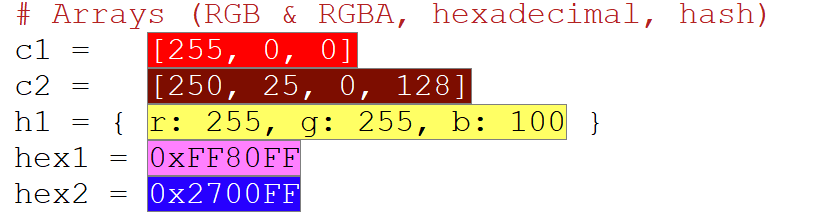

# DragonRuby Emacs Mode 🐉

<div align="center">
  
  <br><br>
  <b>"It wasn't supposed to be possible."</b><br>
  We built this not just to write code, but to feel it. A love letter to the DragonRuby community and the infinite potential of Emacs.
</div>

---

## 🏛️ The New Standard: A Quiet Revolution

For years, we accepted that "powerful" meant "complicated" and "fast" meant "ugly". We didn't agree.

**DragonRuby Emacs Mode** is a milestone. It is the result of obsessively asking: *"What if your editor felt less like a tool and more like an extension of your mind?"*

We haven't just added features; we have established an **Invisible Order**. From the zero-latency sprite rendering to the industrial-grade memory management, every line of code here exists to protect your flow. We don't want to receive the credit; we want you to create the impossible, and forget we are even here.

This is our contribution to the craft. This is the new baseline.

---

## ⚔️ The Stable Arsenal (The Foundational Base)

### 🎨 Level 1: Semantic Spectrum (Colors)
Visualize the invisible. Your game's palette, alive in your code.
- **Living Color Blocks**: Hex literals (`0xFF00FF`), RGB/RGBA Arrays `[255, 0, 0]`, and Hashes `{r: 255, g: 0, b:0}` — the moment you type them, they transform into visual beacons revealing their true color. Multi-line hashes handled with surgical precision.
- **Contrast Intelligence**: Text automatically adapts (black or white) to ensure readability on any background.

<div align="center">
  
  <br><em>Arrays, RGBA hashes, and hexadecimal — all detected and visualized.</em>
</div>

### 🖼️ Level 2: Reconnaissance Operations (Sprites)
Stop coding blind. See your world as you build it.
- **Inline Intelligence**: High-definition thumbnails embedded directly in your code.
- **The Validation Law**: Cyan = Ready, Red = Missing, Orange = Illegal Format.
- **"Double C-M-i" Workflow** (CAPF):
  - Type `spr` + `C-M-i` → Expands to `""` (cursor inside).
  - Press `C-M-i` again → You'll see **only valid sprites** from your project.
  - **Without plugin**: You'd see all project files mixed together.
  - **With plugin**: You see only files from the `sprites/` folder with valid extensions (PNG, BMP, JPG, etc.).

> 💡 **Immersive UI**: By default, suggestions appear in the minibuffer. For a **floating popup** experience like modern IDEs, install **`company-mode`**. The plugin automatically feeds it your sprites, fonts, and paths.
> ```elisp
> M-x package-install RET company
> (global-company-mode)
> ```

### 🎨 The Forge: Integrated Image Editor

Press `RET` or `C-c C-o` on any sprite in your code and the header-line transforms into a **complete workstation**. You'll have access to a professional arsenal with non-destructive timeline, tool groups (VIEW, TRANSFORM, COLOR, SYSTEM, CREATIVE), and over 15 operations: remove backgrounds, trim margins, pixel-perfect scaling (2x/0.5x), apply effects, rotate, invert, compress, and much more. All without leaving Emacs.

<div align="center">
  
  <br><em>VIEW, TRANSFORM, COLOR, SYSTEM, CREATIVE — Five tool groups, infinite power.</em>
</div>

### 🌐 Level 4: The Creative Hub (Beta)
Your bridge to the ecosystem. Located within the Image Editor header-line:
- **Instant Web Tools**: One-click access to **Graphite**, **Piskel**, **Lospec**, **Itch.io**, and the DragonRuby Discord.
- **Customizable**: Add your own tools (Web URLs or Local Executables) via the `[+]` button.
- **Adaptive**: Tools have custom colors and can be hidden/shown to fit your workflow.

**→ [📖 Complete Image Editor Guide](knowledge/IMAGE_EDITOR.md)** (Timeline, Tool groups, Creative Hub)


### ⚡ Level 3: Curvature Navigation (The Law)
Eliminate journey friction. Move at the speed of thought.
- **Contextual Intelligence**: The plugin knows when you're in a `require`, a `read_file`, or a `path:` assignment and filters your destinations accordingly.
- **Dimensional Links**: Every path is a portal. `C-c C-o` or `RET` to jump directly to any file or asset.
- **CAPF Completion**: Press `C-M-i` inside a string to see files of the correct type based on context. With **`company-mode`** installed, suggestions appear in a floating IDE-style popup.

---

## 💎 Tactical Arsenal (Beta)

### 🔊 The Resonance Engine (Audio) — Beta
Audio components are no longer silent text. Feel your game's heartbeat.
- **Emerald Pulse**: Valid assets shine with vibrant green energy (`#2ECC71`).
- **Format Sentinel**: Instant suppression of weak formats. `.mp3` is marked and neutralized.
- **Chronicle Tooltips**: Instant file size information on hover.

### 🅰️ The Glyph Engine (Fonts)

> ⚠️ **Requires [ImageMagick](https://imagemagick.org/)** to render previews.

Did you pick the right font? Why doesn't it look like you expected? Stop guessing. Press `RET` on any font and visualize it **in real-time** with your own text, pangrams in 5 languages, or the full alphabet.

- **Smart Thumbnails**: Automatically adapt to your theme (dark/light).
- **Context Preview**: The plugin reads nearby `text:` values (limited to 11 characters to prevent overflow). Write `text: "Press Start"` near your font, and the thumbnail shows that phrase.

<div align="center">
  
  <br><em>The plugin reads "Press Start" from nearby text: and renders it in the font.</em>
</div>

- **Creative Hub**: Explore fonts from within the editor. Available buttons: **Google Fonts**, **DaFont**, **Font Squirrel**. Add `[+]` or remove `[-]` your own links to customize.

**→ [📖 Complete Font System Guide](knowledge/FONTS.md)** (ABC/Pangram Viewer, Typography resources, Troubleshooting)

### 🌌 Level 5: The Time Machine (Stargate) — EXPERIMENTAL
The ultimate mastery of the simulation. Record, Mutate, and Rewind.
- **The Chronicler**: Automatic recording of states, seeds, and inputs at every tick. All history is persisted in a JSON-based Forest of Timelines.
- **The Surgeon (Surgical Injection)**: When you save code, Stargate analyzes the risk (Alpha/Beta/Gamma). If your change crashes the game, the **Dead Hand Rollback** automatically restores the previous valid state.
- **Timeline Navigation**: Use `M-x dragonruby-stargate-timeline-render` to visualize your history. Scrub through frames and jump between divergent realities.
- **Organic Pulse**: Synchronized with the Kernel's heart. Stargate searches for your game in silence and attaches its nerves only when the "Dragon" is breathing.


### 🤝 Compatibility with Other Plugins

Designed to **not interfere** with your existing configuration:

| Plugin/System | Status | Notes |
|---------------|--------|-------|
| **LSP** (eglot, lsp-mode) | ✅ Stable | Non-exclusive CAPF, low priority (90-100) |
| **Company** | ✅ Stable | Compatible with `:exclusive 'no` |
| **Vertico/Ivy/Helm** | ✅ Stable | Doesn't affect minibuffer system |
| **Flycheck/Flymake** | ✅ Stable | Low priority overlays (-50) |
| **Evil Mode** | ✅ Stable | Doesn't modify standard keymaps |
| **Corfu** | 🧪 To test | Should work (same CAPF system) |
| **Doom Emacs** | 🧪 To test | Compatible with individual components |

💡 **Philosophy**: We add capabilities without replacing your workflow.

⚠️ **Community Testing**: This table is subject to continuous verification. If you find any incompatibility, **[report a bug on GitHub Issues](https://github.com/Macgyber/dragonruby-mode/issues)** so we can improve the plugin's stability.

---

### 🏭 The Industrial Standard
**"The visible speed is born from the invisible order."**

We have re-engineered the core to meet **SRE & Performance Engineering** standards:
- **Zero Blocking**: Sprite scanning is now instantaneous. Heavy image processing is strictly deferred to idle time (lazy loading).
- **Controlled Memory**: Implemented **Singleton Timer Patterns** to prevent resource leaks during rapid interaction.
- **Silent Core**: The system now handles invalid contexts (like scratchpads) with absolute silence, ensuring stability 100% of the time.

---

## 📦 Installation

Choose your preferred method. For a quick setup in **Doom Emacs**, simply copy these blocks:

```elisp
;; 1. In ~/.doom.d/packages.el
(package! dragonruby-mode :recipe (:host github :repo "Macgyber/dragonruby-mode"))

;; 2. In ~/.doom.d/config.el
(use-package! dragonruby-mode
  :hook ((ruby-mode . dragonruby-maybe-enable)
         (ruby-ts-mode . dragonruby-maybe-enable)))
```

**→ [📖 Complete Installation Guide](knowledge/INSTALLATION.md)** (Detailed instructions for Doom Emacs, straight.el, Spacemacs, use-package, manual, and more)

---

## 🏗️ Architecture: The Lego System (Beta)
"Complexity is the enemy. Modularity is the shield."

We have re-forged the core into a **Lego Architecture**. The system is no longer a monolith; it is a collection of independent, intelligent pieces orchestrated by a central Kernel.

### 🧠 The Kernel
The Kernel is the central nervous system. It strictly enforces the **Three Laws**:
1.  **Namespace Law**: Every module owns its space. No collisions.
2.  **Capability Law**: Modules request powers (e.g. `:rendering`), and the Kernel finds the provider.
3.  **Cold Boot Law**: Nothing runs until you ask for it. Zero zombie processes.

### 🧱 Assembling Your Legos
You have total control. Enable or disable individual pieces in your config. The Kernel handles the wiring automatically.

To customize your experience, add these lines to your `config.el` (Doom) or `init.el` (Vanilla) **before** loading the mode:

```elisp
;; Example: Minimalist Setup (Code Only)
(setq dragonruby-enable-sprites nil)      ; Disable graphics
(setq dragonruby-enable-audio nil)        ; Disable audio
(setq dragonruby-enable-completion t)     ; Keep schema-based autocomplete
(setq dragonruby-enable-paths t)          ; Keep fast navigation
```

| Lego Piece | Capability | Default |
|------------|------------|---------|
| `sprites` | Visual rendering, thumbnails | 🔴 OFF |
| `sprite-tools` | Image Editor, transformations | 🔴 OFF |
| `fonts` | TTF/OTF visuals, pangram viewer | 🔴 OFF |
| `audio` | Sound file detection, size info | 🔴 OFF |
| `colors` | Hex/RGB highlighting | 🔴 OFF |
| `concepts` | Educational concept popups | 🔴 OFF |
| `paths` | Project navigation, file jumping | 🔴 OFF |
| `stargate` | Time travel, atomic injections (Experimental) | 🔴 OFF |
| `completion` | Strict YAML API Schema | ✅ ON |
| `guide` | Knowledge guidance system (Sidebar) | 🔴 OFF |

If you disable a parent (e.g., `sprites`), the Kernel **automatically** powers down its children (`sprite-tools`) to prevent errors. You don't have to manage dependencies. Just build your perfect editor.

### 🧠 The Sovereign Kernel (v0.7.3 Architect)
The v0.7.3 update introduces the **Sovereign Kernel**, a central authority inspired by micro-kernel operating systems.
- **The Ledger of Life**: Every timer, hook, and process must be registered. If the Kernel doesn't know it, it shouldn't exist.
- **Surgical Hot-Reload (F6)**: Forget the "nuclear options" of the past. Our reload follows a strict `Shutdown -> Unload -> Load -> Reboot` cycle, ensuring a clean state without destroying the Emacs global environment.
- **Zombie Hunt**: A background safety net that scans the Emacs subsystem for any orphaned processes or timers, neutralizing them instantly.

- **The Memory (Guide)**: Loads definitions from `.org` files into a unified hash-table cache.
- **The Retina (Concepts)**: Scans your code and queries the Knowledge Kernel for instant context.
- **Hierarchy of Silence**: Tooltips are suppressed when the Guidance Sidebar is open to keep your workspace clear.
- **Follow Mode**: The sidebar automatically synchronizes with the concept under your cursor.

---

### 📜 Level 5: The Schema (v0.1 Validated)
**"No magic. Just truth."**

An artisan autocompletion system that respects your definitions. It is **NOT** an LSP. It does not infer, guess, or think. It simply allows you to define a schema for your API, and the editor honors it.

- **Strict YAML Schema**: Define your API in `dragonruby_api.yml` using a strict, artisan-friendly format (2-space indent, maps only).
- **Zero Hallucination**: It only completes what you explicitly define as a root (e.g. `args.`). It never guesses types.
- **Fail-Safe**: If your schema is invalid, the system silently steps aside. It never interrupts your flow with errors.
- **Introspection**: Use `M-x dragonruby-inspect-contract` to visualize the active knowledge tree.
- **Automatic Detection**: The system looks for `dragonruby_api.yml` in your project root. If missing, it automatically uses the global schema residing in the plugin's own folder.


### 🧠 Autocomplete Experience
- **Fluid Typing**: Type `arg` -> Select `args` -> System auto-inserts `.` -> Type `st` -> Select `state`.
- **Smart Dot**: Typing a `.` after a valid contract keyword (like `args`) triggers the completion menu **automatically**.
- **Shortcuts**: Use `C-M-i` (Standard) or **`C-.`** (Windows-friendly) to trigger completion manually.
- **UI Recommendation**: For a "Google-like" popup experience, we highly recommend installing **`company-mode`**. The backend will automatically feed it data.
  - `M-x package-install RET company`
  - `(global-company-mode)`

---

## 📚 Documentation and Resources

- **[📖 IMAGE_EDITOR.md](knowledge/IMAGE_EDITOR.md)**: Complete image editor guide
- **[📖 FONTS.md](knowledge/FONTS.md)**: Font system and typography
- **[📜 MANIFESTO.md](knowledge/MANIFESTO.md)**: The Project's Existential Boundaries
- **[📖 INSTALLATION.md](knowledge/INSTALLATION.md)**: All installation methods
- **[🤝 CONTRIBUTING.md](knowledge/CONTRIBUTING.md)**: Guide for contributors
- **[💬 GitHub Issues](https://github.com/Macgyber/dragonruby-mode/issues)**: Report bugs or request features

---

*Forged for creators who refuse to settle. Forged for DragonRuby.*

**DragonRuby Emacs Mode — v0.7.3**

[](https://opensource.org/licenses/MIT)
